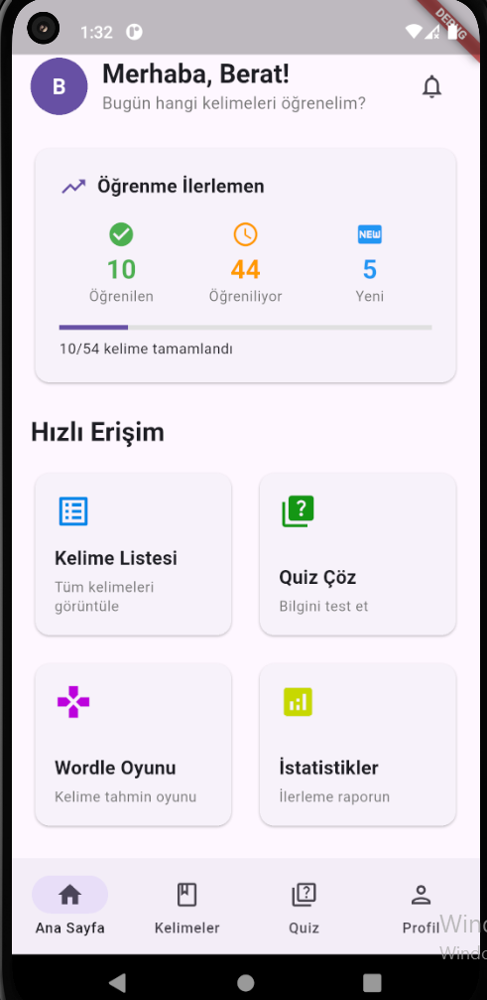
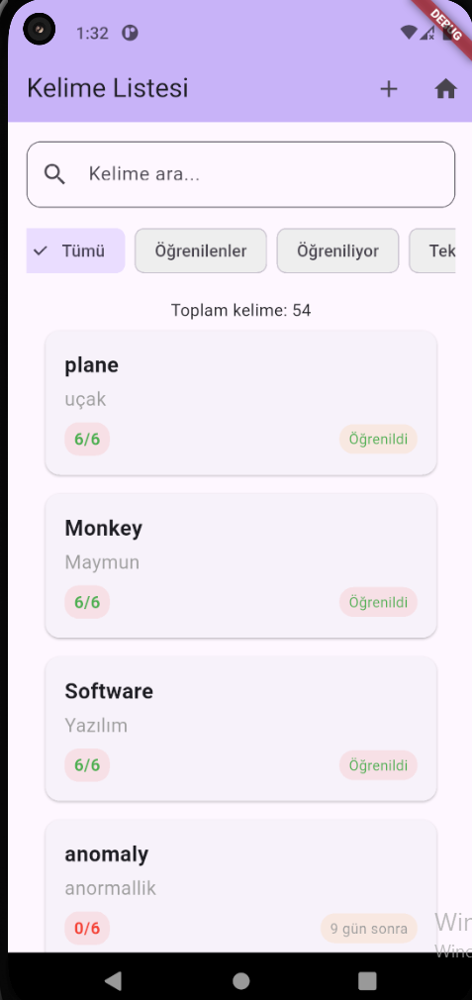
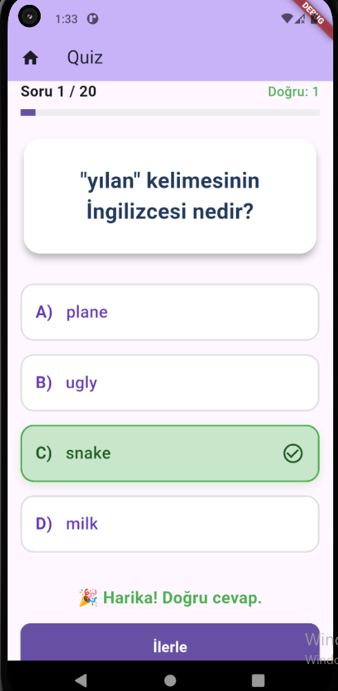
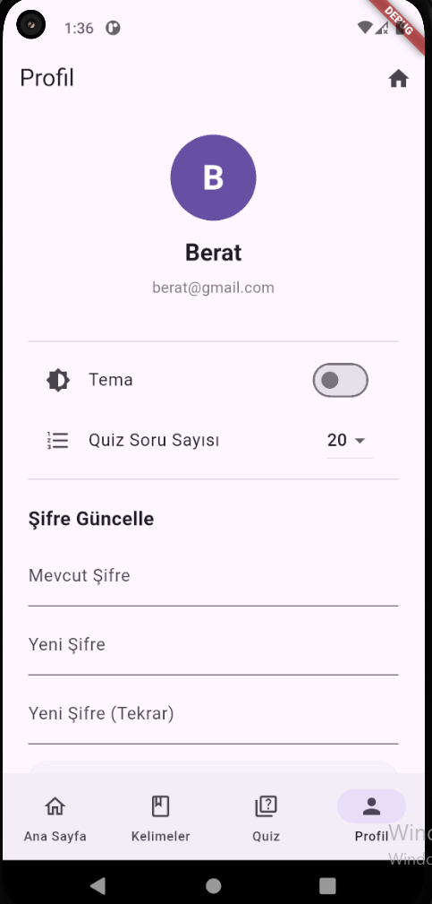
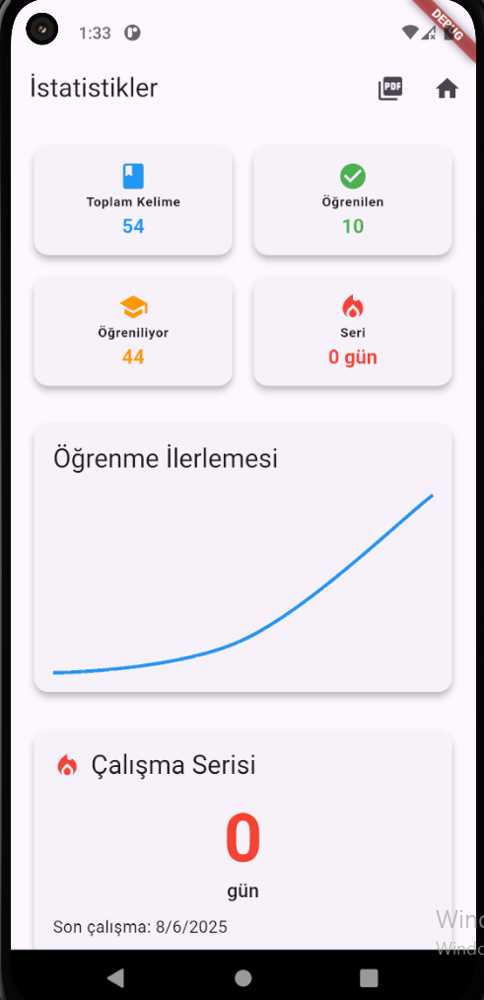
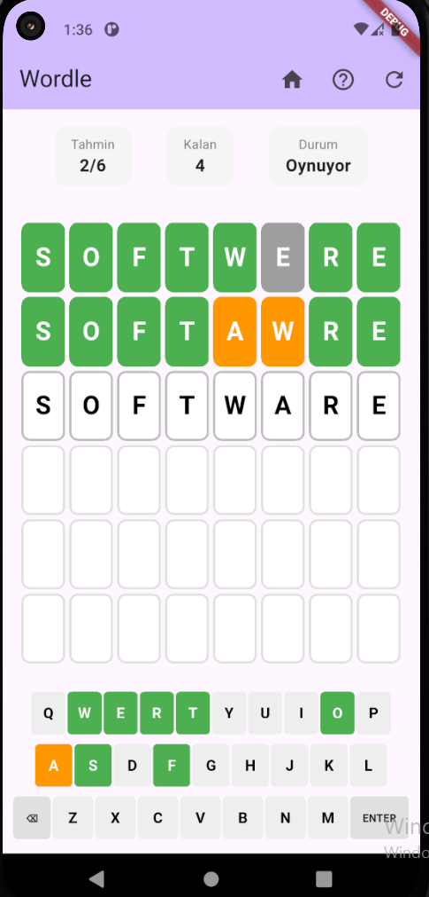

<<<<<<< HEAD
# İngilizce Kelime Öğrenme Uygulaması

Bu proje, Scrum metodolojisi kullanılarak geliştirilecek bir İngilizce kelime öğrenme uygulamasıdır. Uygulama, 6 sefer ile kelime ezberleme sistemi kullanarak etkili öğrenme sağlar.

## 🎯 Proje Özeti

- **Dönem Notma Etkisi**: %40
- **Proje Son Gönderim Tarihi**: Dönemin Son Haftası
- **Takım Üye Sayısı**: En fazla 4 kişi ile sınırlıdır

## 📱 Özellikler


## 🛠️ Teknoloji Stack

### Frontend (Mobil Uygulama)
- **Flutter**: Cross-platform mobil uygulama geliştirme
- **Dart**: Programlama dili
- **Provider**: State management
- **Go Router**: Navigation
- **Material 3**: Modern UI tasarım sistemi

### Backend
- **Node.js**: Server-side JavaScript runtime
- **Express.js**: Web framework
- **PostgreSQL**: Veritabanı

### Paketler
- `provider`: State management
- `go_router`: Navigation
- `http`: API istekleri
- `shared_preferences`: Local storage
- `font_awesome_flutter`: İkonlar
- `lottie`: Animasyonlar

## 🏗️ Proje Yapısı

```
lib/
├── main.dart                 # Ana uygulama dosyası
├── providers/               # State management
│   ├── auth_provider.dart
│   ├── word_provider.dart
│   └── quiz_provider.dart
├── screens/                 # Ekranlar
│   ├── splash_screen.dart
│   ├── auth/
│   │   ├── login_screen.dart
│   │   └── register_screen.dart
│   ├── home/
│   │   └── home_screen.dart
│   ├── words/
│   │   └── word_list_screen.dart
│   ├── quiz/
│   │   └── quiz_screen.dart
│   ├── wordle/
│   │   └── wordle_screen.dart
│   └── profile/
│       └── profile_screen.dart
├── models/                  # Veri modelleri
├── services/               # API servisleri
├── widgets/                # Yeniden kullanılabilir widget'lar
└── utils/                  # Yardımcı fonksiyonlar
```

## 🚀 Kurulum

### Gereksinimler
- Flutter SDK (3.7.2 veya üzeri)
- Dart SDK
- Android Studio / VS Code
- Git

### Adımlar

1. **Projeyi klonlayın**
   ```bash
   git clone <repository-url>
   cd english_learning_app
   ```

2. **Bağımlılıkları yükleyin**
   ```bash
   flutter pub get
   ```

3. **Uygulamayı çalıştırın**
   ```bash
   flutter run
   ```

## 📋 Geliştirme Durumu

### ✅ Tamamlanan
- [x] Proje yapısı oluşturuldu
- [x] Material 3 tema yapılandırması
- [x] Splash screen animasyonları
- [x] Login/Register ekranları
- [x] Ana sayfa dashboard tasarımı
- [x] State management (Provider) kurulumu
- [x] Navigation (Go Router) yapılandırması
- [x] Temel kelime modeli ve provider

### 🔄 Devam Eden
- [ ] Kelime listesi ekranı
- [ ] Quiz modülü
- [ ] Wordle oyunu
- [ ] Backend API entegrasyonu

### 📅 Planlanan
- [ ] Kullanıcı profil yönetimi
- [ ] Analiz raporu ekranı
- [ ] Word Chain oyunu
- [ ] Sesli okunuş özelliği
- [ ] Resim yükleme sistemi

## 🎨 Tasarım Özellikleri

- **Modern UI**: Material 3 tasarım sistemi
- **Responsive**: Farklı ekran boyutlarına uyumlu
- **Animasyonlar**: Smooth geçişler ve etkileşimler
- **Dark/Light Mode**: Sistem temasına uyumlu
- **Accessibility**: Erişilebilirlik standartlarına uygun

## 🔧 Geliştirme Notları

### Spaced Repetition Algoritması
Kelime tekrarı için aşağıdaki aralıklar kullanılır:
- 1. tekrar: 1 gün sonra
- 2. tekrar: 3 gün sonra
- 3. tekrar: 7 gün sonra
- 4. tekrar: 14 gün sonra
- 5. tekrar: 30 gün sonra
- 6. tekrar: 90 gün sonra

### Veritabanı Şeması
```sql
-- Users tablosu
Users (UserID, UserName, Password)

-- Words tablosu  
Words (WordID, EngWordName, TurWordName, Picture)

-- WordSamples tablosu
WordSamples (WordSamplesID, WordID, Samples)
```

## 👥 Takım

Bu proje Scrum metodolojisi kullanılarak geliştirilmektedir. Takım üye sayısı en fazla 4 kişi ile sınırlıdır.

## 📞 İletişim

Proje hakkında sorularınız için lütfen takım üyeleri ile iletişime geçin.

---

**Not**: Bu proje eğitim amaçlı geliştirilmektedir ve dönem notunun %40'ını oluşturmaktadır.
=======

# 📚 6 Sefer Tekrar Prensibine Dayalı Kelime Ezberleme Uygulaması



Bu mobil uygulama, **Scrum metodolojisi** kullanılarak geliştirilen bir **İngilizce kelime ezberleme** oyunudur. Uygulama, Ebbinghaus’un unutma eğrisine dayalı olarak **6 farklı zamanda yapılan tekrarlar** ile kullanıcıların kelimeleri uzun süreli hafızalarında tutmalarını hedefler.

## 🚀 Özellikler

| Modül | Açıklama |
|-------|----------|
| 👤 Kullanıcı Sistemi | Kayıt ol, giriş yap ve şifremi unuttum özelliği |
| ➕ Kelime Ekleme | İngilizce kelime, Türkçe karşılığı, örnek cümle, görsel (isteğe bağlı ses) |
| 🧠 6 Sefer Sınav Modülü | Aynı kelimenin 6 farklı tarihte doğru cevaplanması gerekir |
| ⚙️ Ayarlar | Günlük çıkan yeni kelime sayısı ayarlanabilir |
| 📊 Analiz Raporu | Konu bazlı başarı oranları ve çıktı alınabilir rapor |
| 🧩 Bulmaca (Wordle) | Öğrenilen kelimelerden 5 harfli tahmin oyunu |
| 🔗 Word Chain | LLM destekli görsel + kelime zincirleme hikaye modülü |

## 📸 Ekran Görüntüleri

| Ana Sayfa | Kelime Ekleme | Sınav Ekranı |
|-----------|----------------|---------------|
|  |  |  |

| Ayarlar | Analiz | Wordle |
|--------|--------|--------|
|  |  |  |

## 📱 Kullanıcı Akışı

1. **Kayıt Ol / Giriş Yap**
2. **Kelimeleri Ekle** (İngilizce-Türkçe + görsel + örnek cümle)
3. **Sınava Başla**: 6 tekrar algoritması ile kişiye özel testler.
4. **İlerlemeni Takip Et**: Analiz ekranı ile başarı yüzdelerini gör.
5. **Bulmaca & Zincir Modülleri** ile öğrenilenleri oyunlaştır.

## 🧠 6 Sefer Tekrar Prensibi

Uygulama, bir kelimenin uzun süreli öğrenilmesi için aşağıdaki zamanlamaya göre tekrar edilmesini gerektirir:

- 1 gün sonra
- 1 hafta sonra
- 1 ay sonra
- 3 ay sonra
- 6 ay sonra
- 1 yıl sonra

Her tekrar aşamasında kullanıcı doğru cevap verirse, sistem otomatik olarak bir sonraki aşamaya geçer. Hatalı cevaplarda ise sayaç sıfırlanır.

## 📊 Analiz ve Raporlama

Kullanıcılar, öğrenme süreçlerini şu metriklerle takip edebilir:

- Çözülmüş toplam sınav sayısı
- Günlük hedef ilerlemesi
- Öğrenilen kelime yüzdesi
- Konu bazlı başarı durumu
- Günlük tekrar serisi (streak)
- Kağıt çıktısı alınabilir PDF analiz raporu

## 🛠 Teknolojiler

- **Frontend**: Flutter (Dart)
- **Backend**: Node.js (Express)
- **Veritabanı**: PostgreSQL
- **Kimlik Doğrulama**: JWT
- **Ekstra**: LLM & AI Tabanlı Görsel Üretim, SonarQube analizi (opsiyonel)

## 🧩 Bonus Özellikler

- Rastgele karışık şıklar
- Sınav süresi ayarlanabilir yapı
- Zorluk seviyesi
- Boş sorulara dönüş özelliği
- Admin paneli ile kelime yönetimi
- Öğrenciye özel sınav tanımlama

## 🧪 Kurulum

```bash
git clone https://github.com/kullaniciadi/kelime-ezberleme-app.git
cd kelime-ezberleme-app
flutter pub get
```

**Backend çalıştırmak için:**

```bash
cd backend
npm install
node app.js
```

**PostgreSQL yapılandırma:** `.env` dosyasına aşağıdaki bilgileri girin:

```
DB_HOST=localhost
DB_PORT=5432
DB_USER=...
DB_PASS=...
DB_NAME=kelime_app
```

## 📁 Proje Yapısı

```
/frontend      → Flutter mobil uygulama
/backend       → Node.js API
/screenshots   → README için ekran görüntüleri
/video         → Uygulama tanıtım videosu
```

## 🎥 Demo Videosu

📺 [Uygulama Tanıtım Videosu (MP4)](./video/uygulama_demo.mp4)

## 📌 Katkıda Bulunanlar

| İsim | Numara |
|------|--------|
| Emre Yılmaz | 2021123456 |
| Ayşe Koç | 2021123457 |

## 📋 Proje Durumu ve Beyan

| Modül | Var mı? |
|-------|---------|
| Kayıt/Giriş/Şifre Yenileme | ✅ |
| Kelime Ekleme | ✅ |
| Sınav Modülü | ✅ |
| Kelime Sıklığı Değiştirme | ✅ |
| Analiz Raporu | ✅ |
| Wordle | ✅ |
| Word Chain (LLM) | ✅ |

## 📅 Scrum & Versiyon Kontrol

- Trello Board Ekran Görüntüsü: [./screenshots/scrum.png](./screenshots/scrum.png)
- GitHub Commitleri: En az 2 farklı katkıcı

## 🏁 APK Linki

Android APK (mobil demo): [indir (apk)](./build/app-release.apk)

## 🧹 Kod Kalitesi

- ✅ KISS Prensibi
- ✅ SonarQube Uyumlu
- ✅ Temiz Kodlama
- ✅ Modüler Yapı

## 📄 Lisans

MIT Lisansı
>>>>>>> 6a9c92b31b2a24e5f0f739d61ffe0efeb2ee3f95


....

